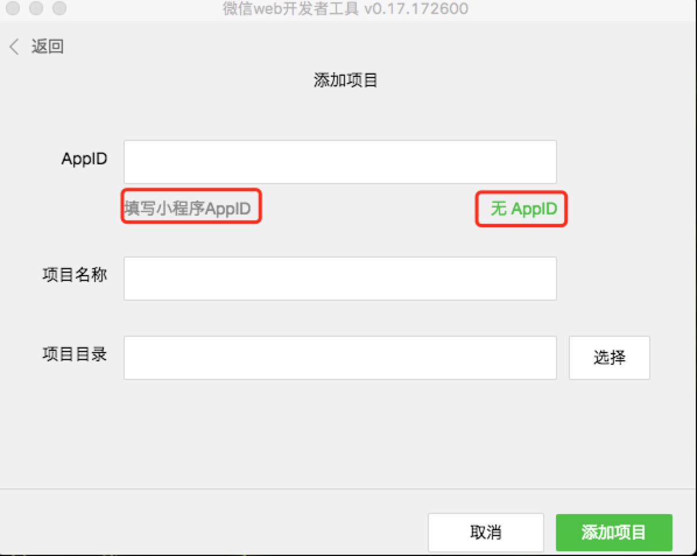
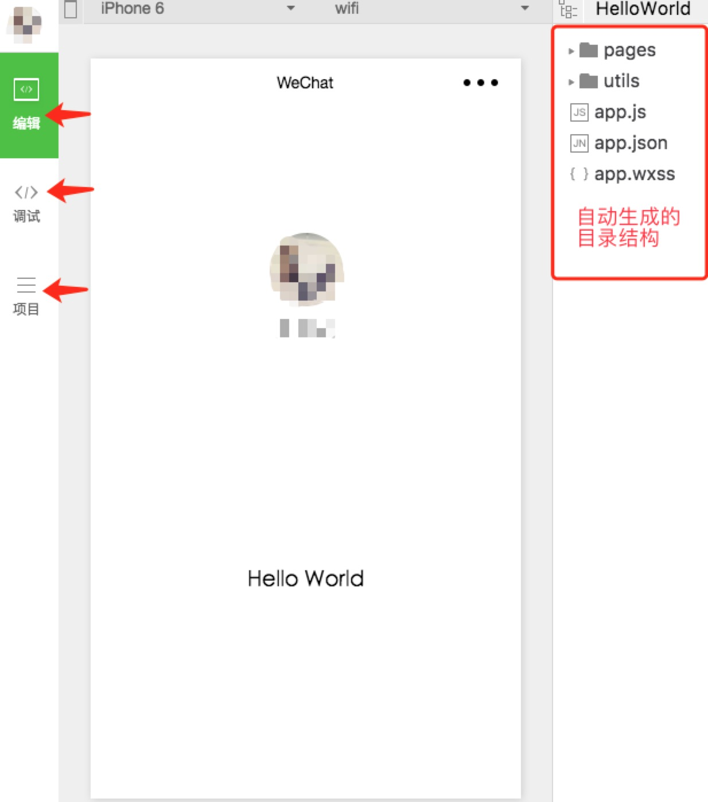

## <a>&sect; 小程序开发工具安装</a>
在上一节第 8 步所展示的页面中，可以点击 `开发者工具` 直接进入到下载页面，也可以直接访问 [官网下载地址](https://mp.weixin.qq.com/debug/wxadoc/dev/devtools/download.html)。然后根据自己的设备选择相应的下载  
安装过程不再复述，一路默认。  
  

  

   

下载开发工具

  

  
   

## <a>&sect; 小程序工具起手</a>  
> *此教程选择的工具为 mac 平台版本，没差*  
1. 打开安装好的 `微信web开发者工具` ，需要用 `管理员` 或 `开发者` 的微信账号扫码登录。`管理员账号` 是上一节第 6 步中注册 `appID` 时，绑定的微信账号。开发者账号可在上一节第 8 步中的 `添加开发者` 中设置

  

  
   

2. 登录成功后，选择 `本地小程序项目`，然后 `添加项目`

  
  
  

  
   

3. 如果没有注册 `appID`，也可以开发小程序项目，但部分功能会受限，比如在手机上预览。在这里，我们已经有了 `appID`

  

   

4. 添加成功后，我们的项目会在 `微信web开发者工具` 中自动打开并启动，可以在此工具中对代码进行修改、调试、断点、预览，文件有修改的话，项目会实时更新。 

  

   

<a href="./ch1-0.md">上一篇：获取小程序appID</a>

<a href="./ch1-2.md">下一篇：小程序结构目录说明</a>
