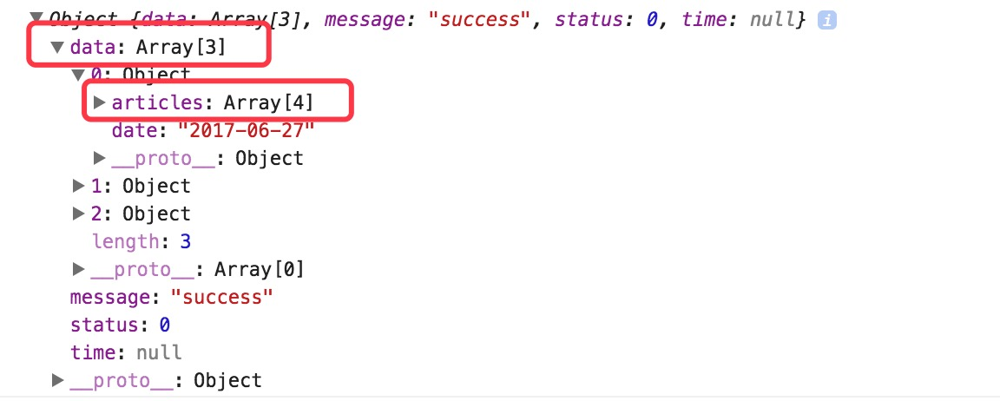

## <a>&sect; 页面逻辑处理</a>  
> 开始前请把 `/codes/ch3-2` 导入微信开发工具  

<br>

### 修改 `index.js` 文件，引入我们需要的外部资源  
```js
'use strict';

import util from '../../utils/index';
import config from '../../utils/config';

let app = getApp();
let isDEV = config.isDev;

// 后继的代码都会放在此对象中
let handler = {

}
Page(handler)
```  

<br>  

### 数据绑定  
我们首先挖出和渲染相关的数据，并添加在 `handler` 对象的 `data` 字段中（Model 层）  
修改 `index.js` 中的 `handler` 对象：
```js
// 此处省略部分代码
let handler = {
  data: {
    page: 1, //当前加载第几页的数据
    days: 3,
    pageSize: 4,
    totalSize: 0,
    hasMore: true,// 用来判断下拉加载更多内容操作
    articleList: [], // 存放文章列表数据，与视图相关联
    defaultImg: config.defaultImg
  },
}
```  

**注意：** 后续添加的代码都是放在 `handler` 对象中，它会传递到 `Page` 函数中用来初始化页面组件  
<br>  

### 获取数据  

然后要做的就是获取列表的数据，初始化数据的工作我们一般放在生命周期的 `onLoad()` 里：  
```js
let handler = {
  onLoad (options) {
    this.requestArticle()
  },
  /*
   * 获取文章列表数据
   */
  requestArticle () {
    util.request({
      url: 'list',
      mock: true,
      data: {
        tag:'微信热门',
        start: this.data.page || 1,
        days: this.data.days || 3,
        pageSize: this.data.pageSize,
        langs: config.appLang || 'en'
      }
    })
    .then(res => {
      console.log( res )  
    });
  } 
}
```  
<br>  

### 数据加载完成之后，我们需要对接口返回的数据进行业务方面的容错处理  
修改 `requestArticle` 函数：  
```js
let handler = {
  // 此处省略部分代码
  requestArticle () {
    util.request({
      url: 'list',
      mock: true,
      data: {
        tag:'微信热门',
        start: this.data.page || 1,
        days: this.data.days || 3,
        pageSize: this.data.pageSize,
        langs: config.appLang || 'en'
      }
    })
    .then(res => {
      // 数据正常返回
      if (res && res.status === 0 && res.data && res.data.length) {
          // 正常数据 do something
          console.log(res)
      } 
      /*
      * 如果加载第一页就没有数据，说明数据存在异常情况
      * 处理方式：弹出异常提示信息（默认提示信息）并设置下拉加载功能不可用
      */ 
      else if (this.data.page === 1 && res.data && res.data.length === 0) {
          util.alert();
          this.setData({
              hasMore: false
          });
      } 
      /*
      * 如果非第一页没有数据，那说明没有数据了，停用下拉加载功能即可
      */ 
      else if (this.data.page !== 1 && res.data && res.data.length === 0) {
          this.setData({
              hasMore: false
          });
      } 
      /*
      * 返回异常错误
      * 展示后端返回的错误信息，并设置下拉加载功能不可用
      */ 
      else {
          util.alert('提示', res);
          this.setData({
              hasMore: false
          });
          return null;
      }
    })
  } 
}
```  
<br>  

上面我们把 `wx.request` 重新包装成了 `Promise` 的形式，其实我们是请求的 mock 数据。但是接口请求到的数据绝大部分情况下都不会直接适用于 `UI` 展示，所以我们需要做一层数据转换，把接口数据转换成视图数据。  

<br>  

### 格式化数据  
先看下后端返回的数据结构  

<div align="center">
    
</div>  

<br>  

我们需要做两件事情  
1. 遍历 `data` 数组，对返回的日期格式化，当天的显示 `今天`，如果是今年的文章，显示月日格式 `08-21` ；如果是往年的文章，显示标准的年月日格式 `2015-06-12`。   
2. 遍历 `articles` 数组，判断此篇文章的 `contentId` 是否已经在全局变量 `visitedArticles` 中，如果存在，说明已经访问过。  

修改 `app.js`，增加全局变量 `visitedArticles` 
```js
globalData: {
  user: {
    name: '',
    avator: ''
  },
  visitedArticles: ''
}
```  

<br>  

修改 `index.js` 中的 `requestArticle` 函数：  
```js
let handler = {
  // 此处省略部分代码
  requestArticle () {
    // 注意：修改此处代码
    if (res && res.status === 0 && res.data && res.data.length) {
      let articleData = res.data;
      //格式化原始数据
      let formatData = this.formatArticleData(articleData);
      console.log( formatData )
    } 
  }
}
```  

<br>  

增加对列表数据格式化的代码：
```js
let handler = {
  // 此处省略部分代码
  /*
  * 格式化文章列表数据
  */
  formatArticleData (data) {
      let formatData = undefined;
      if (data && data.length) {
          formatData = data.map((group) => {
              // 格式化日期
              group.formateDate = this.dateConvert(group.date);
              if (group && group.articles) {
                  let formatArticleItems = group.articles.map((item) => {
                      // 判断是否已经访问过
                      item.hasVisited = this.isVisited(item.contentId);
                      return item;
                  }) || [];
                  group.articles = formatArticleItems;
              }
              return group
          })
      }
      return formatData;
  },
  /*
  * 将原始日期字符串格式化 '2017-06-12'
  * return '今日' / 08-21 / 2017-06-12
  */
  dateConvert (dateStr) {
      if (!dateStr) {
          return '';
      }
      let today = new Date(),
          todayYear = today.getFullYear(),
          todayMonth = ('0' + (today.getMonth() + 1)).slice(-2),
          todayDay = ('0' + today.getDate()).slice(-2);
      let convertStr = '';
      let originYear = +dateStr.slice(0,4);
      let todayFormat = `${todayYear}-${todayMonth}-${todayDay}`;
      if (dateStr === todayFormat) {
          convertStr = '今日';
      } else if (originYear < todayYear) {
          let splitStr = dateStr.split('-');
          convertStr = `${splitStr[0]}年${splitStr[1]}月${splitStr[2]}日`;
      } else {
          convertStr = dateStr.slice(5).replace('-', '月') + '日'
      }
      return convertStr;
  },
  /*
  * 判断文章是否访问过
  * @param contentId
  */
  isVisited (contentId) {
      let visitedArticles = app.globalData && app.globalData.visitedArticles || '';
      return visitedArticles.indexOf(`${contentId}`) > -1;
  },
}
``` 

<br>

正常情况下，这个时候控制台打印出来的数据，是经过格式化的标准数据了，下一步，我们需要把它添加到 `data` 中的 `articleList` 字段里面，这样视图才有了渲染的数据  

<br>  

修改 `index.js`，增加 `renderArticle` 函数。由于每次请求的都是某一页的数据，所以在函数中，我们需要把每次请求过来的列表数据都 `concat`（拼接）到 `articleList`中：  
```js
let handler = {
  // 此处省略部分代码
  renderArticle (data) {
      if (data && data.length) {
          let newList = this.data.articleList.concat(data);
          this.setData({
              articleList: newList
          })
      }
  }
}
```  

<br>  

在 `requestArticle` 函数中调用 `renderArticle`:  
```js
let handler = {
  // 此处省略部分代码
  requestArticle () {
    // 注意：修改此处代码
    if (res && res.status === 0 && res.data && res.data.length) {
      let articleData = res.data;
      //格式化原始数据
      let formatData = this.formatArticleData(articleData);
      this.renderArticle( formatData )
    } 
  }
}
```

<br>

### 最终结果

最终的 `index.js` 文件就是这样的：

```javascript
'use strict';

import util from '../../utils/index'
import config from '../../utils/config'

let app = getApp()
let isDEV = config.isDev

// 后继的代码都会放在此对象中
let handler = {
  data: {
    page: 1, //当前的页数
    days: 3,
    pageSize: 4,
    totalSize: 0,
    hasMore: true,// 用来判断下拉加载更多内容操作
    articleList: [], // 存放文章列表数据
    defaultImg: config.defaultImg
  },
  onLoad(options) {
    this.requestArticle();
  },
  /*
  * 获取文章列表数据
  */
  requestArticle() {
    util.request({
      url: 'list',
      mock: true,
      data: {
        tag: '微信热门',
        start: this.data.page || 1,
        days: this.data.days || 3,
        pageSize: this.data.pageSize,
        langs: config.appLang || 'en'
      }
    })
      .then(res => {
        // 数据正常返回
        if (res && res.status === 0 && res.data && res.data.length) {
          let articleData = res.data;
          //格式化原始数据
          let formatData = this.formatArticleData(articleData);
          this.renderArticle(formatData)
        }
        /*
        * 如果加载第一页就没有数据，说明数据存在异常情况
        * 处理方式：弹出异常提示信息（默认提示信息）并设置下拉加载功能不可用
        */
        else if (this.data.page === 1 && res.data && res.data.length === 0) {
          util.alert();
          this.setData({
            hasMore: false
          });
        }
        /*
        * 如果非第一页没有数据，那说明没有数据了，停用下拉加载功能即可
        */
        else if (this.data.page !== 1 && res.data && res.data.length === 0) {
          this.setData({
            hasMore: false
          });
        }
        /*
        * 返回异常错误
        * 展示后端返回的错误信息，并设置下拉加载功能不可用
        */
        else {
          util.alert('提示', res);
          this.setData({
            hasMore: false
          });
          return null;
        }
      })
  },
  /*
  * 格式化文章列表数据
  */
  formatArticleData(data) {
    let formatData = undefined;
    if (data && data.length) {
      formatData = data.map((group) => {
        // 格式化日期
        group.formateDate = this.dateConvert(group.date);
        if (group && group.articles) {
          let formatArticleItems = group.articles.map((item) => {
            // 判断是否已经访问过
            item.hasVisited = this.isVisited(item.contentId);
            return item;
          }) || [];
          group.articles = formatArticleItems;
        }
        return group
      })
    }
    return formatData;
  },
  /*
  * 将原始日期字符串格式化 '2017-06-12'
  * return '今日' / 08-21 / 2017-06-12
  */
  dateConvert(dateStr) {
    if (!dateStr) {
      return '';
    }
    let today = new Date(),
      todayYear = today.getFullYear(),
      todayMonth = ('0' + (today.getMonth() + 1)).slice(-2),
      todayDay = ('0' + today.getDate()).slice(-2);
    let convertStr = '';
    let originYear = +dateStr.slice(0, 4);
    let todayFormat = `${todayYear}-${todayMonth}-${todayDay}`;
    if (dateStr === todayFormat) {
      convertStr = '今日';
    } else if (originYear < todayYear) {
      let splitStr = dateStr.split('-');
      convertStr = `${splitStr[0]}年${splitStr[1]}月${splitStr[2]}日`;
    } else {
      convertStr = dateStr.slice(5).replace('-', '月') + '日'
    }
    return convertStr;
  },
  /*
  * 判断文章是否访问过
  * @param contentId
  */
  isVisited(contentId) {
    let visitedArticles = app.globalData && app.globalData.visitedArticles || '';
    return visitedArticles.indexOf(`${contentId}`) > -1;
  },
  renderArticle(data) {
    if (data && data.length) {
      let newList = this.data.articleList.concat(data);
      this.setData({
        articleList: newList
      })
    }
  }
}
Page(handler)
```  

<br>

下一篇中，我们将会把数据与视图层结合在一起，动态的展示视图层  

<br>

<a href="../readme.md">返回大纲</a>  

<a href="./ch3-1.md">上一篇：列表 - 静态页面制作</a>  

<a href="./ch3-3.md">下一篇：列表 - 视图与数据关联</a>
