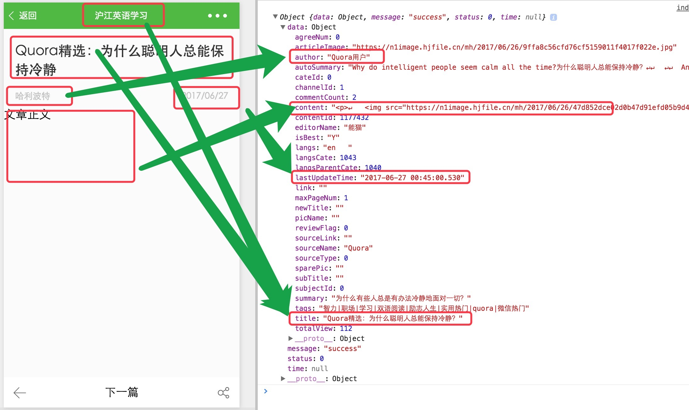

## <a>&sect; 详情 - 数据渲染</a>
> 开始前请把 `/codes/ch4-2` 导入微信开发工具  
> 这一节中，我们开始详情的接口调用、数据加载和视图渲染过程。 

<br>  

### Step 1. 引入公用的一些工具库，修改 `detail.js`： 
```js
'use strict';

import util from '../../utils/index';
import config from '../../utils/config';

// WxParse HtmlFormater 用来解析 content 文本为小程序视图
import WxParse from '../../lib/wxParse/wxParse';
// 把 html 转为化标准安全的格式
import HtmlFormater from '../../lib/htmlFormater';

let app = getApp();
Page({

});
```  
<br>  

### Step 2. 修改 `detail.js` 在页面初始化时候，请求接口，加载详情数据  
```js
Page({
  onLoad (option) {
    /*
    * 函数 `onLoad` 会在页面初始化时候加载运行，其内部的 `option` 是路由跳转过来后的参数对象。
    * 我们从 `option` 中解析出文章参数 `contendId`，然后通过调用 `util` 中封装好的 `request` 函数来获取 `mock` 数据。 
    */ 
    let id = option.contentId || 0;
    this.init(id);
  },
  init (contentId) {
    if (contentId) {
      this.requestDetail(contentId)
          .then(data => {
              util.log(data)
          })
    }
  },
  requestDetail(contentId){
    return util.request({
      url: 'detail',
      mock: true,
      data: {
          source: 1
      }
    })
    .then(res => {
      return res
    })
  }
})
```  
<br>    

运行之后，我们查看下控制台输出的数据，是不是很清晰！  
<div align="center">
  
</div>  

<br>  

### Step 3. 接着，把页面头部数据渲染出来  
修改 `requestDetail` 函数，并增加日期格式化的方法，达到我们想要的效果，然后重新返回数据   

```js
Page({
  // 此处省略部分代码

  requestDetail(contentId){
    return util.request({
      url: 'detail',
      mock: true,
      data: {
          source: 1
      }
    })
    .then(res => {
      let formateUpdateTime = this.formateTime(res.data.lastUpdateTime)
      // 格式化后的时间
      res.data.formateUpdateTime = formateUpdateTime
      return res.data
    })
  },
  formateTime (timeStr = '') {
    let year = timeStr.slice(0, 4),
        month = timeStr.slice(5, 7),
        day = timeStr.slice(8, 10);
    return `${year}/${month}/${day}`;
  }
}）
```  

<br>  

现在我们已经获取到了后端返回的数据，并且已经把部分数据标准处理过。下一步，我们把返回的数据同步到 `Model` 层中（也就是 `data` 对象中）  
我们增加 `configPageData` 函数，用它来处理数据同步到 `data`的逻辑：  
```js
Page({
  data: {
    detailData: {

    }
  },
  init (contentId) {
    if(contentId) {
      this.requestDetail(contentId)
          .then(data => {
              this.configPageData(data)
          })
    }
  },
  configPageData(data){
    if (data) {
        // 同步数据到 Model 层，Model 层数据发生变化的话，视图层会自动渲染
        this.setData({
            detailData: data
        });
        //设置标题
        let title = this.data.detailData.title || config.defaultBarTitle
        wx.setNavigationBarTitle({
            title: title
        })
    }
  }
})
```  
<br>

因为页面的标题是随着文章变化的，所以需要我们动态设置，这里我们调用了小程序自带的方法来设计  
```js
wx.setNavigationBarTitle({
  title: '标题'
})
```
<br>  

修改视图 `detail.wxml` 的头部 `class="info"` 内容：  
```html
<view class="info">
    <view class="info-title">{{ detailData.title }}</view>
    <view class="info-desc cf">
        <text class="info-desc-author fl">{{ detailData.author }}</text>
        <text class="info-desc-date fr">{{ detailData.formateUpdateTime}}</text>
    </view>
    <view class="info-line under-line"></view>
</view>
```  
<br>  

### Step 4. 调用 `parse` 解析接口返回的 `content` 字段（文本内容）  
当详情数据返回后，我们已经对部分数据进行了过滤处理，现在修改 `detail.js` 中的 `init` 函数，增加对文章正文的处理：  
```js
    articleRevert () {
      // this.data.detailData 是之前我们通过 setData 设置的响应数据
      let htmlContent = this.data.detailData && this.data.detailData.content;
      WxParse.wxParse('article', 'html', htmlContent, this, 0);
    },
    init (contentId) {
      if (contentId) {
        this.requestDetail(contentId)
          .then(data => {
            this.configPageData(data)
          })
          //调用wxparse
          .then(()=>{
            this.articleRevert()
          })
      }
    },
```  
<br>  

注意看上面的 `articleRevert` 函数，变量 `htmlContent` 指向文章的正文数据，当其传入到组件 `WxParse` 后，同时带入了 5 个参数  

```js
WxParse.wxParse('article', 'html', htmlContent, this, 0);
```  
<br>  

第一个参数 `article` 很重要，在 `WxParse` 中，我们传入了当前对象 `this`，当变量 `htmlContent` 解析之后，会把解析后的数据赋值给当前对象，并命名为 `article`  
<div align="center">
  
</div>  
<br>  

所以当文章数据解析后，当前环境上下文中已经存在了数据 `article`，可以直接在 `detail.wxml` 中引用：  

```js
this.data.article
```  
<br>  

修改 `detail.wxml`，引用我们的文章正文数据：  
```html
<!-- 先引入解析模板  -->
<import src="../../lib/wxParse/wxParse.wxml"/>

<!-- 修改文章正文节点  -->
<view class="content">
    <template is="wxParse" data="{{wxParseData:article.nodes}}"/>
</view>
```  
<br>  

再看下页面效果，文章已经正常的显示了，但我们还需要优化下样式，比如增加一些行高、文字间距、字体大小颜色、图片居中等。修改样式文件 `detail.wxss`，`增加` 以下样式  
```css
.wrapper .content {
  padding: 0 36rpx;
  padding-bottom: 40rpx;
  line-height: 56rpx;
  color: #333;
  font-size: 36rpx;
  overflow: hidden;
  word-wrap: break-word
}

.wrapper .content .langs_cn,.wrapper .content .para.translate {
  font-size: 32rpx;
  color: #666
}

.wrapper .content .langs_cn,.wrapper .content .langs_en,.wrapper .content .para,.wrapper .content .wxParse-p {
  margin: 44rpx 0
}

.wrapper .content image {
  max-width: 100%;
  vertical-align: top
}

.wrapper .content .tip {
  color: #999;
  font-size: 28rpx;
  text-align: center;
  height: 28rpx;
  line-height: 28rpx
}

.wrapper .content .tip-icon {
  vertical-align: top;
  margin-right: 8rpx;
  width: 26rpx;
  height: 26rpx;
  border: 1px solid #999;
  border-radius: 6rpx;
  box-sizing: border-box
}

.wrapper .content .tip-icon.selected {
  border: none;
  background: url(https://n1image.hjfile.cn/mh/2017/06/12/20703f295b7b3ee4f5fe077c4e464283.png) 0 0 no-repeat;
  background-size: contain
}
```

<a href="../readme.md">返回大纲</a>  

<a href="./ch4-1.md">上一篇：详情 - 页面制作</a>  

<a href="./ch4-3.md">下一篇：详情 - 功能完善</a>
