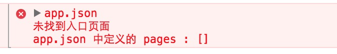
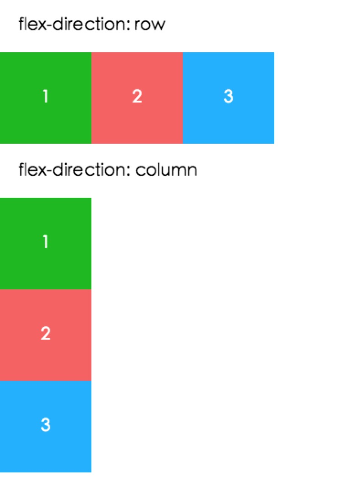
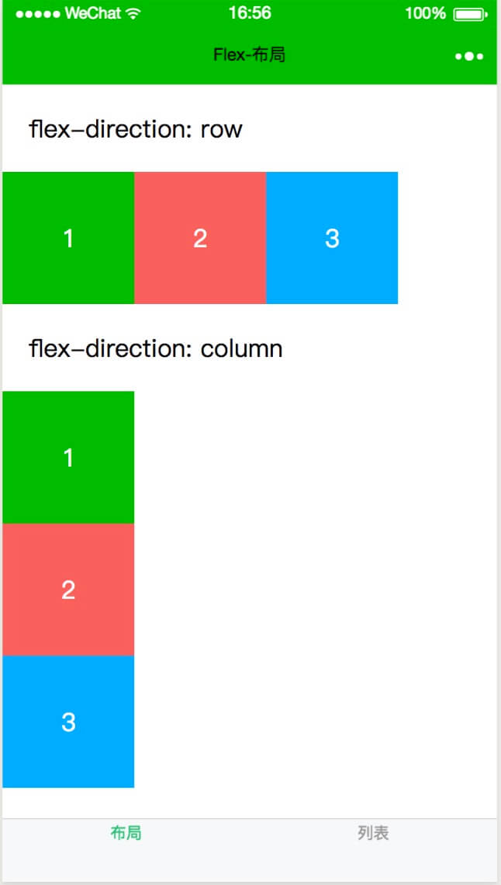
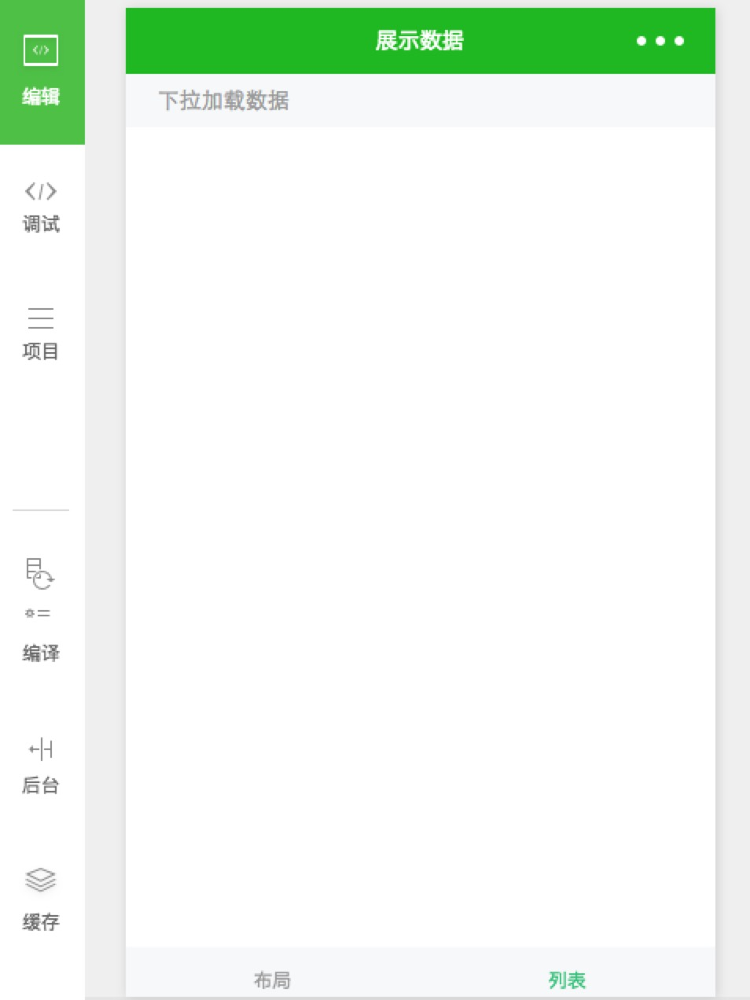
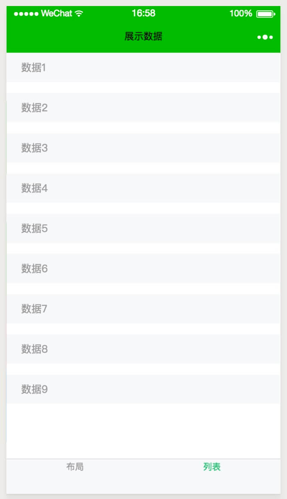
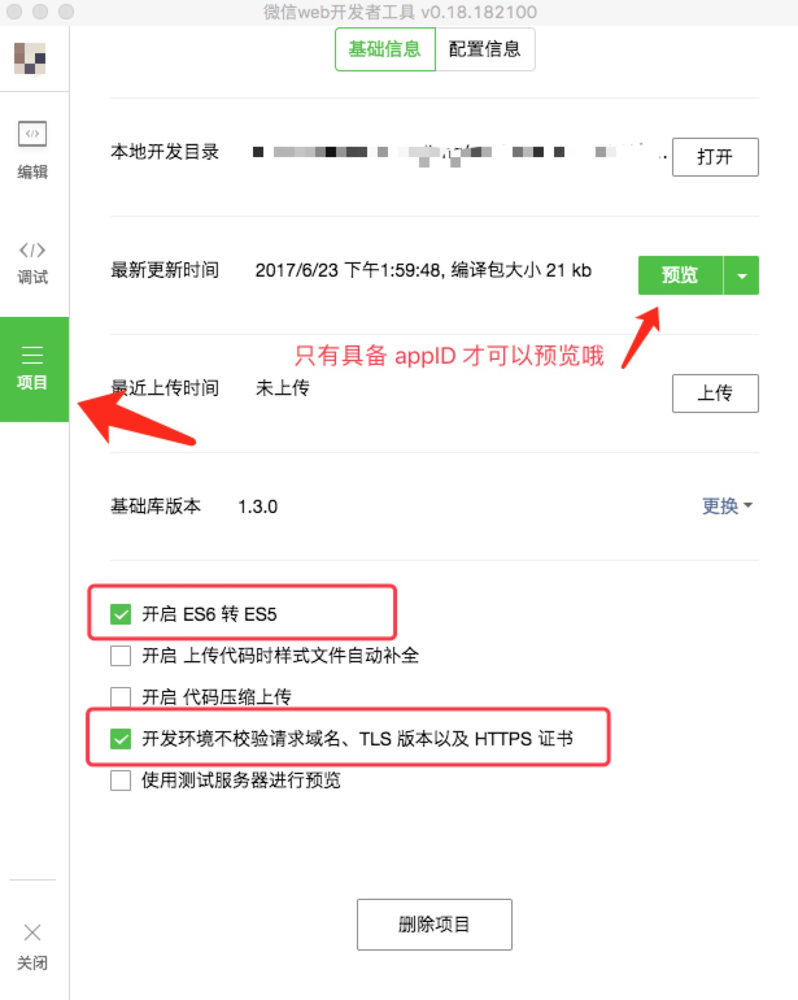

# 第一章：小程序初级入门教程——小试牛刀

<br> 

## <a>&sect; 小试牛刀</a>
> 这一章节中，我们尝试着写一个最简单的例子，包含 2 个静态页面，并增加菜单导航功能。小体验一把。  

### Step 1. 清理结构   
清理后如下结构，只保留了两个 `必备` 文件，同时做如下修改：  
```
├── app.js
├── app.json
```
```js
//app.js
App({
  onLaunch: function () {

  }
})
```  

```json
{
  "pages":[
  ],
  "window":{
    "navigationBarBackgroundColor": "#09ba07",
    "navigationBarTextStyle": "#fff",
    "navigationBarTitleText": "牛刀小试",
    "backgroundColor": "#fbf9fe",
    "backgroundTextStyle": "light"
  }
}
```
<br>  

修改后，看下控制台有报错信息，因为我们把页面全都干掉了。
<div>
  
</div>  
<br>  

从报错信息来看，很明显，小程序默认会从 `pages` 字段中读取第一个地址，作为首页加载 -- `知识点`。  

### Step 2.  增加 flex 页面
ok，现在开始添加我们的第一个页面，给它起个名字叫 `flex` 吧，防止大家 *误以为名字叫 `index` 的才是默认打开的页面*  :)   
<br>  

增加 `flex` 页面文件  

```
├─ mypages/
│   ├─ flex/
│       ├─ flex.js        // 空文件
│       ├─ flex.wxml      // 空文件
│       ├─ flex.wxss      // 空文件
├── app.js
├── app.json
```  

在 `app.json` 中增加 `flex` 页面的配置地址
```json
"pages":[
  "mypages/flex/flex"  
]
```  

想要 `flex` 页面生效，需要在 `flex.js` 中调用全局函数：
```js
// flex.js
Page({

})
```  
<br>  

`Page()` 函数接受一个 `object` 参数，其指定页面的初始数据、生命周期函数、事件处理函数等。  
这时候再看下显示效果，已经没有报错信息了。  
<div align="right">哗--!整个世界清净了 —— 《大话西游》</div>  
<br>  

### Step 3. 书写简单的 `flex` 布局页面
现在我们来实现一个简单的 `flex` 布局效果，就像微信官方平台展示的那个样子： 
<div align="center">
  
</div>
<br>  

首先，在 `flex.wxml` 文件中增加布局标签：  
```html
<view class="section">
  <view class="section__title">flex-direction: row</view>
  <view class="flex-wrp flex-row">
    <view class="flex-item bc_green">1</view>
    <view class="flex-item bc_red">2</view>
    <view class="flex-item bc_blue">3</view>
  </view>
</view>
<view class="section">
  <view class="section__title">flex-direction: column</view>
  <view class="flex-wrp flex-col">
    <view class="flex-item bc_green">1</view>
    <view class="flex-item bc_red">2</view>
    <view class="flex-item bc_blue">3</view>
  </view>
</view>
```
<br>  

然后在 `flex.wxss` 中，增加各 `class` 的样式：  
```css
.section__title{
  padding: 40rpx;
}
.flex-wrp{
  display: flex;
  flex-direction: row;
}
.flex-row{
  flex-direction: row;
}
.flex-col{
  flex-direction: column;
}
.flex-item{
  color: #fff;
  width: 200rpx;
  height: 200rpx;
  text-align: center;
  line-height: 200rpx;
}
.bc_green{
  background-color: #09ba07;
}
.bc_red{
  background-color: #f76160;
}
.bc_blue{
  background-color: #0faeff;
}
```
<br>  

这里主要的东西就是关于 `flex` 的简单布局，想了解更多关于 `flex` 的同学，可以查阅下 [flex 布局教程](http://www.ruanyifeng.com/blog/2015/07/flex-grammar.html?utm_source=tuicool)  
<br>  

一般情况下，不同的页面，都应该有一个独特的 `title`，这就需要我们就给 `flex` 添加一个独立的配置文件 `flex.json`：
```json
{
  "navigationBarTitleText": "Flex-布局"
}
```
<br>  

注意，与最外层的 `app.json` 不同的地方是，`flex.json` 是对全局配置 `app.json` 的补充，且只能覆盖 `app.json` 的 `window` 字段配置信息  
<br>  

### Step 4. 增加 list 页面  
`list` 页面，多少会比 `flex` 要复杂些。  

刚进入到页面时候，显示没有数据的提示信息。随着用户往下滑动，我们需要动态的增加数据，每下滑一次，增加 3 条数据吧，最多 30 条数据。  
同样的，先增加需要的文件：  
```
├─ mypages/
│   ├─ flex/
│       ├─ flex.js
│       ├─ flex.wxml
│       ├─ flex.wxss
│       ├─ flex.json
│   ├─ list/
│       ├─ list.js
│       ├─ list.wxml
│       ├─ list.wxss
├── app.js
├── app.json
```  
<br>  

同时，我们对小程序增加一个 `底部导航菜单`，方便测试我们的页面切换。  
修改 `app.json` 文件：
```json
{
  "pages":[
    "mypages/flex/flex",
    "mypages/list/list"
  ],
  "window": {
    "navigationBarBackgroundColor": "#09ba07",
    "navigationBarTextStyle": "#fff",
    "navigationBarTitleText": "牛刀小试",
    "backgroundColor": "#fbf9fe",
    "backgroundTextStyle": "light"
  },
  "tabBar": {
    "color": "#999",
    "selectedColor": "#2EBF76",
    "borderStyle": "white",
    "backgroundColor": "#f6f8f9",
    "position": "bottom",
    "list": [{
      "pagePath": "mypages/flex/flex",
      "text": "布局"
    }, {
      "pagePath": "mypages/list/list",
      "text": "列表"
    }]
  }
}
```
<br>  

e，我们先来实现 `js` 部分的逻辑，由于需要把数据显示在视图 `wxml` 中，我们需要增加 `data` 字段 ：
```js
Page({
  data: {
    arrList: []
  }
})
```
<br>  

这里说明下，`wxml` 中的动态数据均来自对应 `Page` 的 `data`。当 `data` 中的数据通过 `this.setData` 发生变化时候，视图会随之更新变化。
<br>  
  
因为我们是在用户下滑时候更新数据，这里我们调用下 `onReachBottom` 函数（当到达页面底部时候触发）：  
```js
Page({
  data: {
    arrList: []
  },
  //微信官方提供的事件处理函数，当页面上拉触底时候自动调用该函数
  onReachBottom(){
    console.log('到达页面底部运行此函数')
  }
})
```
<br>  

然后我们开始增加数据的业务逻辑：
```js
Page({
  data: {
    arrList: []
  },
  onReachBottom(){
    console.log('到达页面底部运行此函数')
    this.updateArrList();
  }，
  updateArrList(){
    let arr = this.data.arrList
    arr.push( ...this.createData() )
    this.setData({
      arrList: arr
    })
  },
  createData(){
    let length = this.data.arrList.length
    if(length >= 30 ) return [];
    return Array.from({length: 3},(v, i)=>`数据${1+i+length}`)
  }
})
```
<br>  

当页面到达底部，会调用 `onReachBottom` 函数，在 `onReachBottom` 的最后，我们 `尾调用` 自定义的函数 `updateArrList` 来更新数据。  
`createData` 函数的作用只是单纯的返回包含 3 个元素的数组，最后拼接后的新数据，会通过 `setData` 更新数据 `arrList`，当数据更新后，视图会自动更新。  
<br>  

接下来，我们修改视图文件 `list.wxml`：
```html
<view class="container">
  <block wx:for="{{arrList}}" wx:key="">
    <view class="item">
      <text>{{item}}</text>
    </view>
  </block>
  <block wx:if="{{arrList.length==0}}">
    <view class="item">
      <text>下拉加载数据</text>
    </view>
  </block>
</view>
```
<br>  

`block` 标签并不属于组件，不会在页面中渲染，仅作接收控制属性用  
`for` 循环指令包裹的范围内，子元素默认是 `item`，如果想重新定义它的名字，可以在 `wx:for="{{arrList}}"` 后面增加 `wx:for-item="item"`，同样的，也可以指定数组下标 `wx:for-index="index"`  
<br>  

我们对页面样式做简单的优化，由于当页面高度不够时候，难以操作触发 `onReachBottom`，故我们给当前的页面外层标签 `page` 加一个 `100%` 高度：
```css
page{
  height: 100%;
}
.item{
  background-color:#f6f8f9;
  color:#9a9a9a;
  font-size:14px;
  padding: 10px 20px;
  margin-bottom:15px;
}
```
<br>  

同样的，我们也给 `list` 页面加一个 `title`，增加 `list.json` 文件：
```json
{
  "navigationBarTitleText": "展示数据"
}
```
<br>  

大功告成！！！预览下小 demo 效果  
<div align="center">
  
</div>  
<div align="center">
  
</div>  
<div align="center">
  
</div>    
<br>  
 
如果之前有 `appID`，也可以在手机端预览
<div align="center">
  
</div>  
