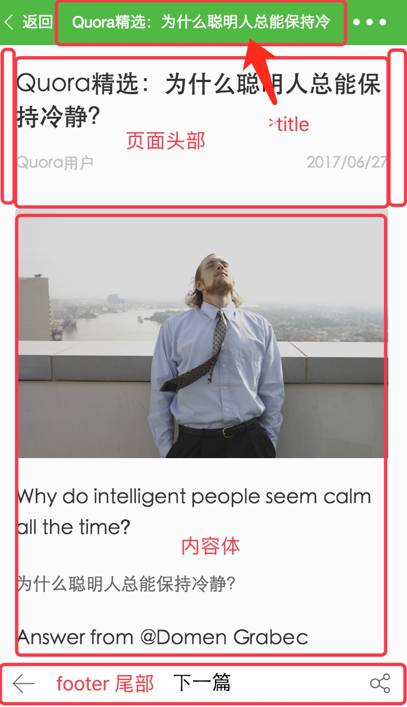

# 第四章：小程序中级实战教程之详情篇  

<br>  

## <a>&sect; 详情 - 页面制作</a>  
> 开始前请把 `ch4-1` 分支中的 `code/` 目录导入微信开发工具  
> 这一章节中，主要介绍详情页的页面制作过程  

<br>

首先看一下我们最终要展示的页面  
<div align="center">
  
</div>  

<br>

页面结构大体分为三部分，也是最常见的布局方式：头部、中间体、尾部。最顶部的是页面 `title`，也就是标题，如果是一般的页面，我们只需要在 `detail.json` 中增加如下配置即可：  
<br>
~~"navigationBarTitleText": "Quora精选：为什么聪明人总能保持冷静"~~

但我们制作的详情页面信息是随着文章内容一直变化的，所以需要在代码中单独处理，就不需要在 `detail.json` 中添加   
这里，我们先制作出：头部和尾部。中间的内容部分，会由 `parse.js` 解析文章数据生成。  
<br>  

### Step 1. 页面准备  
1. 由于文章需要上下滚动，我们采用 `scroll-view` 组件来包括整个页面内容  
```html
<!-- detail.html -->
<scroll-view scroll-y="true" enable-back-to-top="true" class="root-wrap">
</scroll-view> 
```  

[scroll-view](https://mp.weixin.qq.com/debug/wxadoc/dev/component/scroll-view.html) 组件，相当于我们在常规的 `div` 标签上增加了滚动功能并进行封装  
<br>  

2. 然后调整下页面的高度和背景色 
```css
  /* detail.css */
  page {
    background: #fbfbfb;
    height: 100%
  }

  .root-wrap {
    height: 100%
  }
```  
<br>  

### Step 2. 页面头部制作  
1. 头部包含三块内容：大标题、左浮动显示作者、右浮云显示日期，制作如下：  
```html
  <!-- detail.html -->
  <scroll-view scroll-y="true" enable-back-to-top="true" class="root-wrap">
    <view class="wrapper">
      <view class="info">
        <view class="info-title">Quora精选：为什么聪明人总能保持冷静</view>
        <view class="info-desc cf">
          <text class="info-desc-author fl">哈利波特</text>
          <text class="info-desc-date fr">2017/06/27</text>
        </view>
        <view class="info-line under-line"></view>
      </view>
    </view>
  </scroll-view> 
```  
<br>

2. 对应样式文件，注意： `fl(float:left)`、 `fr(float:right)`、 `cf(clear:float)` 三个样式都是在 `base.wxss` 中设置的全局样式
```css
  /* detail.css */
  page {
    background: #fbfbfb;
    height: 100%
  }

  .root-wrap {
    height: 100%
  }

  .wrapper {
    padding-bottom: 96rpx
  }

  .wrapper .top-img {
    width: 100%;
    height: 470rpx;
    vertical-align: top
  }

  .wrapper .info {
    padding: 0 36rpx
  }

  .wrapper .info-title {
    padding: 40rpx 0;
    line-height: 60rpx;
    font-size: 44rpx;
    font-weight: 500;
    color: #333
  }

  .wrapper .info-desc {
    font-size: 28rpx;
    line-height: 30rpx;
    color: #c1c1c1
  }

  .wrapper .info-desc-author {
    max-width: 65%;
    text-overflow: ellipsis;
    white-space: nowrap;
    overflow: hidden
  }

  .wrapper .info-line {
    margin-top: 24rpx
  }
```  
<br>

### Step 3. 页面尾部制作  
> 页尾类似于于菜单导航功能，用户可以进入 `下一篇` 或 `返回` 列表，并且当页面滚动时候，固定在底部不动  

<br>  

修改页面 `detail.html`   
```html
  <!-- 增加以下内容，footbar节点与info节点平级 -->
  <view class="footbar">
    <form>
      <button class="footbar-back clearBtnDefault">
        <view class="icon footbar-back-icon"></view>
      </button>
      <button class="footbar-btn clearBtnDefault">下一篇</button>
      <button class="footbar-share clearBtnDefault">
        <view class="icon footbar-share-icon"></view>
      </button>
    </form>
  </view>
```  
<br>  

修改样式表  
```css
  /* detail.css 增加以下样式内容 */
  .wrapper .footbar {
    position: fixed;
    left: 0;
    bottom: 0;
    width: 100%;
    height: 96rpx;
    line-height: 96rpx;
    background: #fff;
    font-size: 32rpx;
    color: #333
  }

  .wrapper .footbar-back,.wrapper .footbar-share {
    position: absolute;
    width: 96rpx;
    height: 96rpx;
    bottom: 0;
    z-index: 2
  }

  .wrapper .footbar .icon {
    position: absolute;
    width: 42rpx;
    height: 38rpx;
    top: 30rpx
  }

  .wrapper .footbar-back {
    left: 0
  }

  .wrapper .footbar-back-icon {
    left: 30rpx;
    background: url(https://n1image.hjfile.cn/mh/2017/06/06/1305a8ac4dc9347b59cc8c2c667122e5.png) 0 0 no-repeat;
    background-size: contain
  }

  .wrapper .footbar-list {
    left: 0
  }

  .wrapper .footbar-list-icon {
    left: 30rpx;
    background: url(https://n1image.hjfile.cn/mh/2017/06/09/1e630ac45547e6ab5260928e1d57a3c6.png) 0 0 no-repeat;
    background-size: contain
  }

  .wrapper .footbar-btn {
    text-align: center;
    margin: 0 96rpx;
    height: 96rpx;
    line-height: 96rpx
  }

  .wrapper .footbar-share {
    right: 0
  }

  .wrapper .footbar-share-icon {
    right: 30rpx;
    background: url(https://n1image.hjfile.cn/mh/2017/06/09/ebc3852fb865bd19182c09ca599d8ac1.png) 0 0 no-repeat;
    background-size: contain
  }

  .wrapper .clearBtnDefault {
    margin: 0;
    padding: 0;
    background: #fff;
    border: 0;
    border-radius: 0
  }

  .wrapper .clearBtnDefault:after {
    content: '';
    border: none;
    border-radius: 0;
    width: 0;
    height: 0
  }
```  
<br>  
页面尾部制作完成，下一步我们将处理中间的文章内容部分。  


### Step 4. 为中间的 content 内容预留位置
> 完整的页面代码如下   
```html
  <scroll-view scroll-y="true" enable-back-to-top="true" class="root-wrap">
      <view class="wrapper">
          <view class="info">
            <view class="info-title">Quora精选：为什么聪明人总能保持冷静</view>
            <view class="info-desc cf">
              <text class="info-desc-author fl">哈利波特</text>
              <text class="info-desc-date fr">2017/06/27</text>
            </view>
            <view class="info-line under-line"></view>
          </view>
          <!-- 增加正文视图位置  -->
          <view class="content">
              文章正文
          </view>
          <view class="footbar">
              <form>
                  <button class="footbar-back clearBtnDefault">
                      <view class="icon footbar-back-icon"></view>
                  </button>
                  <button class="footbar-btn clearBtnDefault">下一篇</button>
                  <button class="footbar-share clearBtnDefault">
                      <view class="icon footbar-share-icon"></view>
                  </button>
              </form>
          </view>
      </view>
  </scroll-view>
```
