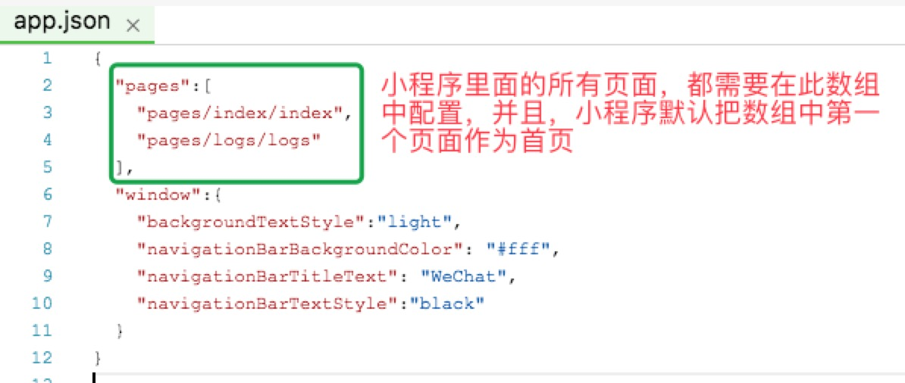

# 第一章：小程序初级入门教程  

<br>  


## <a>&sect; 目录说明</a>  
项目生成后，会看到如下结构的目录文件：
```
├─ pages/
│   ├─ index/
│       ├─ index.js
│       ├─ index.wxml
│       ├─ index.wxss
│   ├─ logs/
│       ├─ logs.js
│       ├─ logs.json
│       ├─ logs.wxml
│       ├─ logs.wxss
├── utils/             
│   ├─ util.js
├── app.js                  // 必备文件  
├── app.json                // 必备文件
├── app.wxss
```

#### 先看下最外层的三个文件：`app.js` 、 `app.json` 、 `app.wxss`
1. app.js  
小程序的主入口文件，类似于我们在模块加载器时代（`requirejs/seajs`）常常会码一个 `main.js` 来作为程序的启动入口。如果你有接触过 `node - express` 技术栈，理解起来会更贴切。注意：<span style="color:red">*文件名不可更改*</span>  
我们可以在 `app.js` 里面对小程序在不同生命周期段进行处理，设置小程序里面的 `全局变量`（比如只请求一次公用的数据，让所有的页面都能用）。    
[微信平台 app.js 说明文档](https://mp.weixin.qq.com/debug/wxadoc/dev/framework/app-service/app.html)
<br>  

2. app.json   
小程序的全局配置文件，比如设置小程序有哪几个页面组成（目前是 `index` 和 `logs`）、窗口表现（背景色等）、设置网络超时时间、设置导航条样式等背景色。注意：<span style="color:red">*该文件不可添加任何注释内容*</span>  
[微信平台 app.json 配置文档](https://mp.weixin.qq.com/debug/wxadoc/dev/framework/config.html)    
<br>  

3. app.wxss  
小程序的全局样式文件，在小程序中，所有的样式文件不再是 `.css` 后缀，全都需要以 `.wxss` 作为后缀。与传统的 `css` 样式相比，`wxss` 支持 `@import` 样式导入和像素单位自适应。   
独立页面中的局部样式，请书写在相对的页面文件夹中，后面会有说明。   
[微信平台 app.wxss 样式说明文档](https://mp.weixin.qq.com/debug/wxadoc/dev/framework/view/wxss.html)  
<br>  

#### 小程序的页面文件  

`app.json` 文件中配置了当前小程序的两个页面 `pages/index/index` 和 `pages/logs/logs`，可以看到，其实就是 `文件的路径+文件名` 组成。如果增加一个页面，需要在参数 `pages` 中把页面的地址配置进去。

<div>
  
</div>
<br>  

细心的同学可能已经发现一个现象，每个页面文件夹，与里面的文件，名字都一样一样滴。是的，一般情况下，一个完整的页面需要 `js` 、`wxss(css)`、`wxml(html)` 组成。   
比如 `index` 页面，如果需要对 `index` 页面进行一些独立的配置，需要像 `logs` 一样，增加 `index.json` 文件来保存配置信息。  
<br>  

#### 来看下 `wxml` 文件与 `html` 文件的区别
```html
<!--index.wxml-->
<view class="container">
  <view  bindtap="bindViewTap" class="userinfo">
    <image class="userinfo-avatar" src="{{userInfo.avatarUrl}}" background-size="cover"></image>
    <text class="userinfo-nickname">{{userInfo.nickName}}</text>
  </view>
  <view class="usermotto">
    <text class="user-motto">{{motto}}</text>
  </view>
</view>
```

传统的 `html` 文件由各种各样的标签组成，而在 `wxml` 中，可用的标签元素并不多，可以看到这里涉及到了 `view`、`image`、`text`标签。  
* view    相当于 `div`，你可以这么去理解。
* image   相当于 `img`，这个应该都懂了。
* text    很明显，用来标注文本的标签，既然是 `文本`，肯定是 `行级元素` 了。  

还有一些内置好的组件标签，自带样式和特性，详见 [官方文档](https://mp.weixin.qq.com/debug/wxadoc/dev/component/)  
<br>  

#### 页面样式表 `index.wxss`  
作用域只在当前页面生效，它可以覆盖 `app.wxss` 里面的样式规则。可以看到，与平时我们用的样式文件基本没差：
```css
/**index.wxss**/
.userinfo {
  display: flex;
  flex-direction: column;
  align-items: center;
}

.userinfo-avatar {
  width: 128rpx;
  height: 128rpx;
  margin: 20rpx;
  border-radius: 50%;
}

.userinfo-nickname {
  color: #aaa;
}

.usermotto {
  margin-top: 200px;
}
```  
<br>  

#### 页面脚本文件 `index.js`  
跟 `app.js` 一样，包含了一个页面的生命周期，声明并处理数据，响应页面交互事件等。
```js
//index.js
//获取应用实例
var app = getApp()
Page({
  data: {
    motto: 'Hello World',
    userInfo: {}
  },
  //事件处理函数
  bindViewTap: function() {
    wx.navigateTo({
      url: '../logs/logs'
    })
  },
  onLoad: function () {
    console.log('onLoad')
    var that = this
    //调用应用实例的方法获取全局数据
    app.getUserInfo(function(userInfo){
      //更新数据
      that.setData({
        userInfo:userInfo
      })
    })
  }
})
```  
